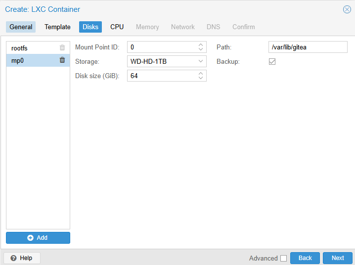
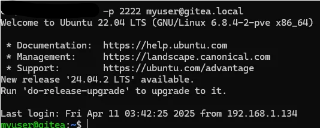
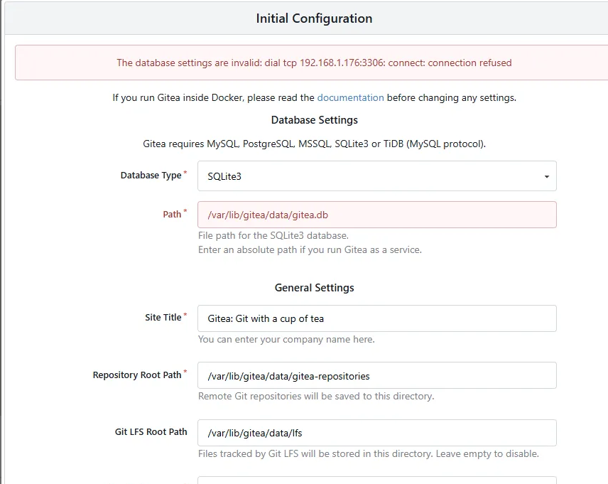
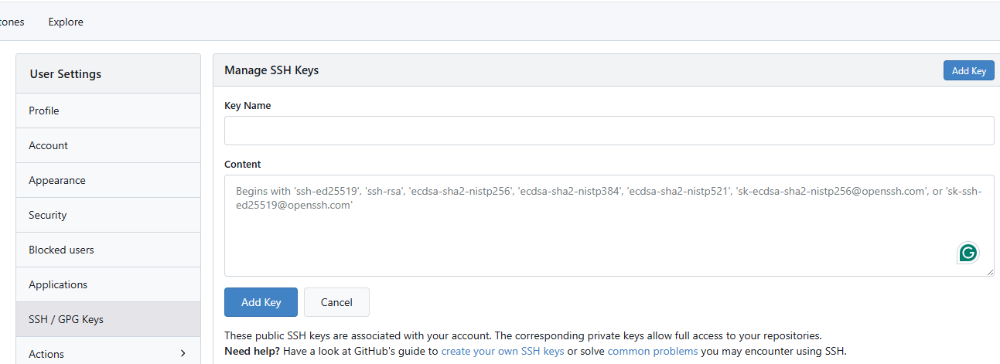
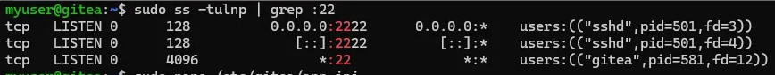
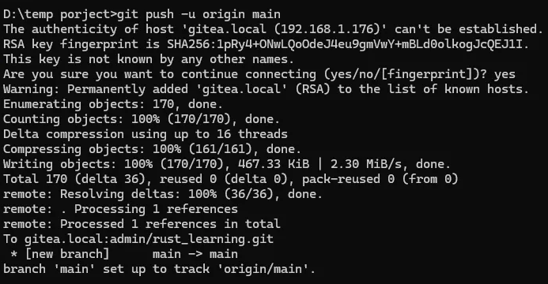
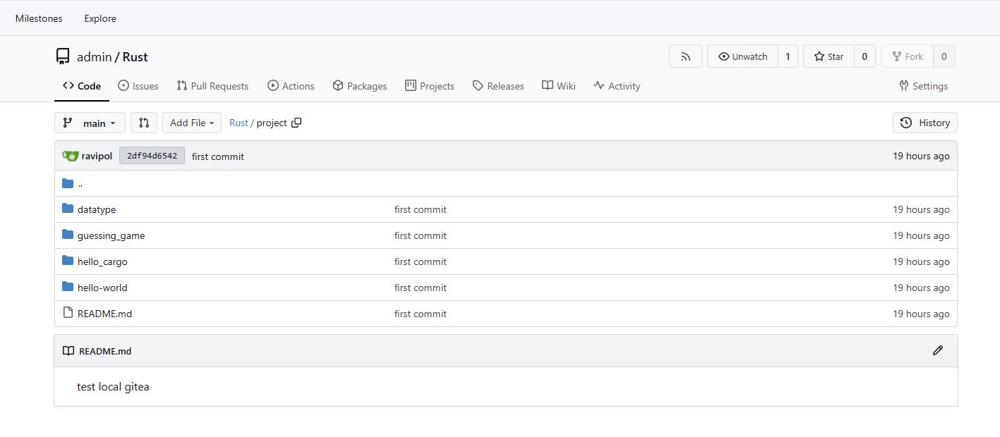
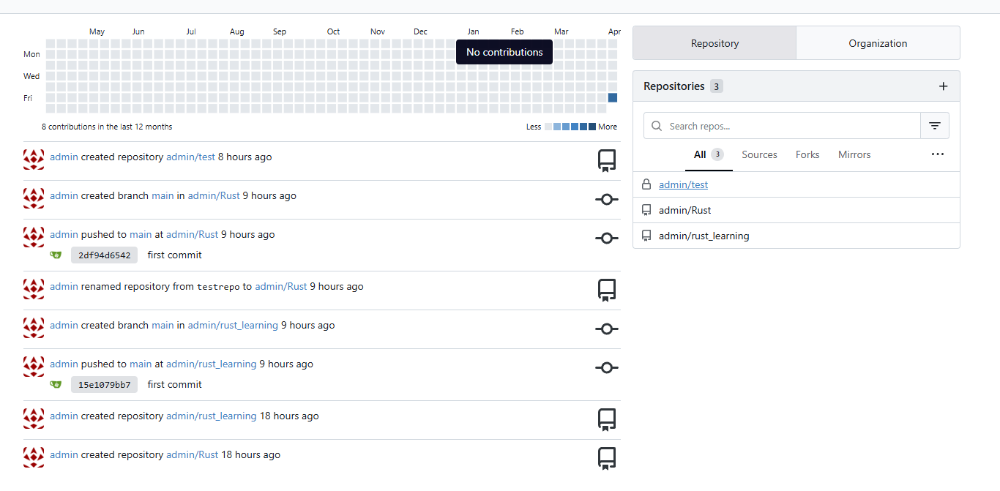

# Installation

Ref : [Gitea docs](https://docs.gitea.com/installation/install-from-binary)

There are some option for you to install for me i love to install from binary and config everything myself

First you have to create your Linux container aka. Lxc or CT (in proxmox) then install gitea

```sh
apt update && apt full-upgrade -y
apt install net-tools git

# From gitea official doc
wget -O gitea https://dl.gitea.com/gitea/1.23.7/gitea-1.23.7-linux-amd64
chmod +x gitea

```

When you create your CT -> proxmox will create a root user for you to ensure security we have to create a dedicated user for gitea service

### Create User

```sh
adduser \
   --system \
   --shell /bin/bash \
   --gecos 'Git Version Control' \
   --group \
   --disabled-password \
   --home /home/git \
   git
```

> !! This user create for gitea service only if you want to create some user to use inside this server you shoud considered create a new user !!

### Config mount volume at the start of installation on proxmox

for me
→ root boot drive 8gb  mounted at /

→ mp0 mount drive at /var/lib/gitea



So the set up should be like this (in Gitea document also provide these command)

```sh
mkdir -p /var/lib/gitea/{custom,data,log}
chown -R git:git /var/lib/gitea/
chmod -R 750 /var/lib/gitea/
mkdir /etc/gitea
chown root:git /etc/gitea
chmod 770 /etc/gitea
```

> There might have some error about lost+found directory in `/var/lib/gitea` just ignore them. they don't have any impact

Define Gitea workdir then copy gitea binary to the system binary
```sh
export GITEA_WORK_DIR=/var/lib/gitea/

cp gitea /usr/local/bin/gitea
```


### Next i want to config it to run as a systemctl service

do `nano  /etc/systemd/system/gitea.service`

```sh
[Unit]
Description=Gitea (Git with a cup of tea)
After=syslog.target
After=network.target

[Service]
# Uncomment the next line if you have repos with lots of files and get a HTTP 500 error because of that
# LimitNOFILE=524288:524288
RestartSec=2s
Type=notify
User=git  
Group=git  
#The mount point we added to the container
WorkingDirectory=/var/lib/gitea
#Create directory in /run
RuntimeDirectory=gitea
ExecStart=/usr/local/bin/gitea web --config /etc/gitea/app.ini
Restart=always
Environment=USER=git HOME=/var/lib/gitea/data GITEA_WORK_DIR=/var/lib/gitea
WatchdogSec=30s
#Capabilities to bind to low-numbered ports
CapabilityBoundingSet=CAP_NET_BIND_SERVICE
AmbientCapabilities=CAP_NET_BIND_SERVICE

[Install]
WantedBy=multi-user.target
```

don't be afraid gitea docs also provide this as well you can take a look [docs](https://docs.gitea.com/installation/linux-service)

Then start the service

```sh
sudo systemctl daemon-reexec
sudo systemctl daemon-reload
sudo systemctl enable gitea
sudo systemctl start gitea
```

### Create a new user to config inside this server

Instead of using root user to do anyhing it a best practice to using another sudoer user instead

```sh
# Gitea Server Machine
adduser myuser
usermod -aG sudo myuser
```

#### Preparing for SSH
```sh
# Our Machine
ssh-keygen -t ed25519 -C "myuser@gitea"
type $env:USERPROFILE\.ssh\myuser_gitea.pub
# Copy the content then paste in the next section
```


```sh
# Gitea Server Machine
mkdir -p /home/myuser/.ssh
echo '<your output from type $env:USERPROFILE\.ssh\myuser_gitea.pub>' > /home/myuser/.ssh/authorized_keys
# if you use linux try finding cat ~/.ssh/myuser_gitea.pub
chown -R myuser:myuser /home/myuser/.ssh
chmod 700 /home/myuser/.ssh
chmod 600 /home/myuser/.ssh/authorized_keys
```

Open `sudo nano /etc/ssh/sshd_config`  and setting like this

```sh
[...]

Port 2222

#LoginGraceTime 2m
PermitRootLogin no               
#StrictModes yes
#MaxAuthTries 6
#MaxSessions 10

PubkeyAuthentication yes
PasswordAuthentication no

[...]

```

This configuration provide you 2 things
1. No Root Login Accepted
2. Change openssh port to 2222 avoid port conflict with Gitea

then

```sh
sudo systemctl restart ssh
sudo systemctl restart gitea
```

### Bonus section since my laptop are window based

#### Config ssh knowhost from client side

At `C:\Users\<user>\.ssh` added this 

- Host can be IPv4 address (in my network i have set up DNS server to resolve internal domainname to private IPv4 address)

```sh
[...]

Host gitea.local
  HostName gitea.local
  User myuser
  IdentityFile ~/.ssh/myuser_gitea
  IdentitiesOnly yes
  
[...]
```

no need to do complicate thing because when you gen ssh-keygen the .pub and other key will be in this folder

### Try Connecting with port 2222

`ssh -p 2222 myuser@<your-domain>`



That work!! nice!!

Now visiting gitea server domain

`192.168.1.176:3000` -> change to your private IPv4 address


> It will pop up configuration -> for beginner i recommend using SQLite3 and also don't forget to create a admin user 



I think i will change the db in the future 


### Now test ssh to a repository

First you have to add your public key to the gitea **ssh key / gpg key**

```sh
# in our machine
ssh-keygen -t ed25519 -C "test@gmail.com"
# save key as gitea_testuser

type $env:USERPROFILE\.ssh\gitea_testuser.pub
#then copy ssh and paste to gitea ssh-key
```




### Next is the Problem , the part that document doesn't mention

I try it myself, i follow the instruction but some how cannot push my code on the repo

and i found that it a port conflict problem and sometime gitea built-in ssh service doesn't start properly


#### The editted nano /etc/gitea/app.ini

note that we have config the System sshd to use port 2222 as a ssh port

now we need to config  `sudo nano /etc/gitea/app.ini`

add `START_SSH_SERVER = true`  to the server part


```sh
[.......]

[database]
DB_TYPE = sqlite3
HOST = 127.0.0.1:3306
NAME = gitea
USER = gitea
PASSWD =
SCHEMA =
SSL_MODE = disable
PATH = /var/lib/gitea/data/gitea.db
LOG_SQL = false

[repository]
ROOT = /var/lib/gitea/data/gitea-repositories

[server]
SSH_DOMAIN = gitea.local
DOMAIN = gitea.local
HTTP_PORT = 80
ROOT_URL = http://gitea.local:80/
APP_DATA_PATH = /var/lib/gitea/data
START_SSH_SERVER = true
DISABLE_SSH = false
SSH_PORT = 22
LFS_START_SERVER = true
LFS_JWT_SECRET = <jwt-secret>

[.......]
```

don't forget to change to Your domain

then

```sh
sudo systemctl restart ssh
sudo systemctl restart gitea

sudo ss -tulnp | grep :22
```



okay so it may work now


## Next try to test push,pull using ssh

just using some random coding folder then following this step

**Creating a new repository on the command line**

```sh
touch README.md
git init
git checkout -b main
git add README.md
git commit -m "first commit"
git remote add origin git@gitea.local:admin/testrepo.git
git push -u origin main
```



ignore the typo it just a rush typing to test the connection


That is all for gitea service you can push your project and anything like this

like github





Thank for your cooperation