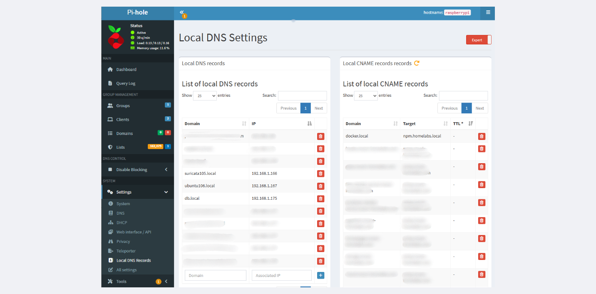

### Introduction

There are two common way to Install Pi-hole on your machine 

1. Using Docker
2. Via Bash Script  

docker installation is pretty easy with a few steps [Docker-pi-hole](https://github.com/pi-hole/docker-pi-hole) and bash script installation with only one command you can take a look at [Pi-hole](https://docs.pi-hole.net/main/basic-install/)

For me i prefered install pi-hole server directry to my machine with

```sh
$ curl -sSL https://install.pi-hole.net | bash
```

The main feature of pi-hole 

1. **URL,Domain blacklisting** -> there are default blacklist that prevent some sort of advertise to pop up on your browser
2. **Domain Name Server (DNS)** -> This is a Quality of Life Since when your labs growing up, you want to define the name for each IP address

Most of Homelaber running pi-hole on low power consumption Hardware such as minipc , N100 , N150 , raspberrypi etc. They have to stay active fr 24/7 because you cannot resolve your domain name to the target IP when it down

My Hardware recommendation are the following

1. Raspberry pi4 or pi5 4-8 Gbs
2. Minipc with low power consumption

Next are my example usecase of pi-hole


### My usecase

I use pihole as a ad-blocker (Domain blacklisting) and Domain name server to resolve my internal domain

to config you can go to web gui via [http://pi.hole/](http://pi.hole/) or http://\<pihole server ip\>/




**Local DNS Record** mean if you using this pi-hole as a DNS server when you query for example **ubuntu106.local** it will resolve to target address **192.168.1.167** So when you typing [http://ubuntu106.local/](#) it look like you query [http://192.168.1.167/](#)

**CNAME Record** record that maps one domain name (alias) to another domain name (canonical name).

It redirects DNS lookups from one domain to another without pointing to an IP address directly

Both feature are good for setting up Reverse proxy 