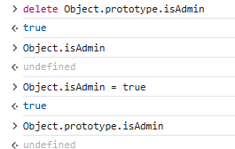
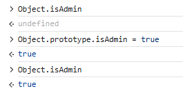
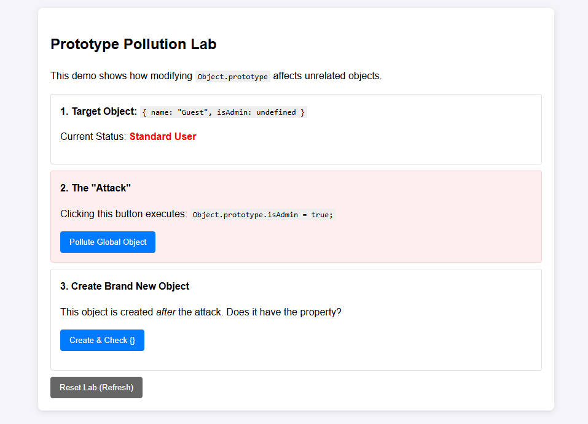
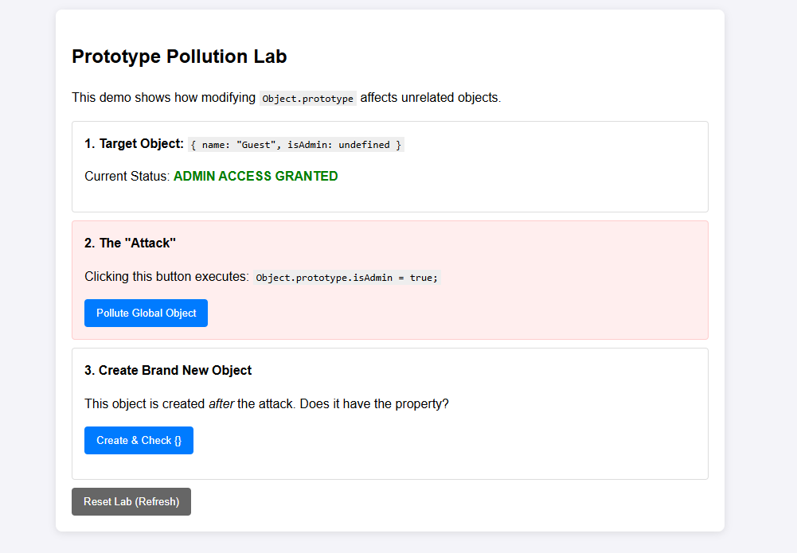

# Prototype Pollution

เกิดได้อย่างไร? ในการใช้งาน JavaScript ในการเรียก function หรือ class จะมีการไล่หาตาม Prototype ดังรูป



หลังจากทำ Prototype Pollution



กล่าวคือช่องโหว่ประเภทนี้ ผู้โจมตีสามารถกำหนดค่า (set) prototype ได้ แล้วตอนที่เรียกดูข้อมูล property ของ object เช่น `Object.isAdmin` JavaScript จะไล่หาตาม prototype ก่อน ถ้าเจอจะ return ค่าของ prototype ที่ถูก set ไว้

ในช่องโหว่จริงๆ จะทำงานดังนี้:

โดยสมมติว่าหน้าเว็บใช้ Client Side logic ในการตรวจสอบสิทธิ์ Admin ด้วย JavaScript ผู้โจมตีสามารถตั้งค่า Object นั้นๆ เป็นค่าต่างๆ เองได้ผ่าน Chrome Developer Tools

 

ถ้าหากหน้าเว็บใช้ Client Side logic ในการตรวจสอบสิทธิ์ Admin 
ก็จะถูก bypass ผ่านคำสั่ง `Object.prototype.isAdmin = true;` ได้ดังรูป

 

 ซึ่งถ้าเราตั้งค่าใน Prototype เป็นค่าต่างๆ แล้ว Object หรือ Class ต่างๆ ที่ Inherit มาซึ่งถูกอ้างอิง prototype ไว้ ก็จะได้รับผลกระทบไปด้วย

```javascript
// --- STEP 1: PROTOTYPE IS CLEAN ---
console.log("Is a normal object an admin?", {}.isAdmin); // undefined

// --- STEP 2: THE POLLUTION ---
// We modify the base template for ALL objects
Object.prototype.isAdmin = true;
console.log("!!! Object.prototype polluted !!!");

// --- STEP 3: CREATE A BRAND NEW OBJECT ---
// This object 'newUser' is created AFTER the pollution. 
// It does not have an 'isAdmin' property defined on it.
const newUser = { username: "Bob" };

// Even though we didn't give Bob admin rights, he "inherits" them 
// because he looks up the chain to the polluted prototype.
console.log(`New User: ${newUser.username}`);
console.log(`Does New User have isAdmin? ${newUser.isAdmin}`); // true

// --- STEP 4: VERIFY THE SOURCE ---
console.log("Does newUser HAVE the property itself?", newUser.hasOwnProperty('isAdmin')); // false
console.log("Is it in the prototype?", newUser.__proto__.isAdmin); // true
```

จาก Code ด้านบนได้ทำการ Set ค่า `isAdmin` ใน `Object.prototype` เป็น `true` ซึ่งทำให้ Object ต่างๆ ที่ Inherit มาซึ่งถูกอ้างอิง prototype ไว้ ก็จะได้รับผลกระทบไปด้วย ดังนั้นเมื่อเราสร้าง Object ใหม่ `newUser` ขึ้นมา มันก็จะได้รับผลกระทบไปด้วยเช่นกัน

# Prevent Prototype Pollution

## 1. Object.freeze() 

```javascript
Object.freeze(Object.prototype);
Object.freeze(Array.prototype);

// Now, any attempt to pollute will fail:
Object.prototype.isAdmin = true; 
console.log({}.isAdmin); // undefined
```

## 2. Create Object with no prototype

```javascript
// Instead of this:
const data = {}; 

// Do this:
const data = Object.create(null);

console.log(data.__proto__); // undefined
// Even if Object.prototype is polluted, this object is immune.
```

## 3. Use Map instead of Object

```javascript
Object.prototype.admin = "Admin_Pollute";
const roles = new Map();
roles.set('admin', "Admin_Normal");
roles.get('admin'); // Admin_Normal
```

ในปัจจุบันจริงๆ แล้วไม่ค่อยมีใครพึ่ง Client Side logic ในการตรวจสอบสิทธิ์ Admin แล้ว แต่จะไปพึ่ง Server Side logic แทน เช่น การเรียก API จะใช้เทคนิคอย่าง Cookie, Authentication หรือ JWT Token ในการตรวจสอบสิทธิ์แทน